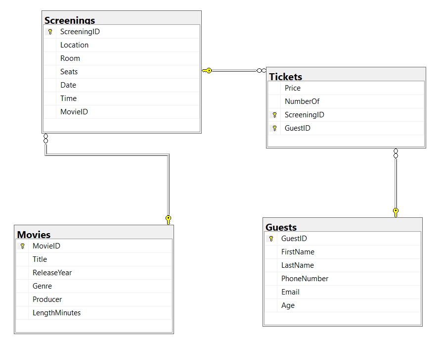
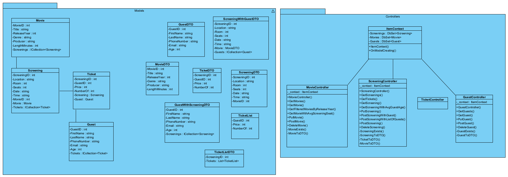

# Web-API-in-ASP.NET-Core

Application that manages 3 entities: `Movies`, `Screenings` and `Guests`. The first two entities are in a `1 to many` relation and the last two are in a `many to many` relation added as a separate entity `Tickets`. Storage is added to a database including migrations to automatically update changes. 

The following functionalities are implemented:
- `CRUD` for all entities
- `filtering` on a numeric field that returns all entities with the numeric field higher than a given value
- `statistical report` involving two entities

`Validation rules` are spread across attributes for checking if a string is empty, if a number is a valid year and if a string could be an email address. The two non-CRUD functionalities are tested by `unit tests` using a `mocking library`.

`Swagger` and `Postman` are used for viewing the functionalities, and tasks are tracked on `Trello` by a `Kanban board`. The application is `deployed to Azure` and usable by anyone with a link to it.
